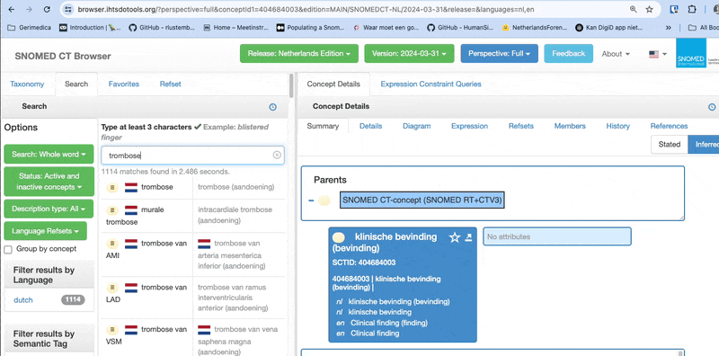

# In het kort

Scripts en mapping om medische voorgeschiedenis te clusteren m.b.v. SNOMED annotaties op de volgende themas:
- PulmonaalLijden
- CardiovasculairLijden
- CerebrovasculairLijden
- DiabetesMellitus
- Dementie
- Nierfalen
- Obesitas
- Parkinson
- Korsakov
- Huntington

# Doel en Scope

Deze repo is een analyse op clustering van vrije tekst (medische voorgeschiedenis) met behulp van SNOMED ontologie.  
Dit is een alternatief op het clusteren op basis van zoektermen, zoals het MATLAB script. Beide benaderingen worden vergeleken. De verkenning van boomstructuren in SNOMED kan nieuwe inzichten geven en is een toets of de informatie vraag beantwoord kan worden.  

Deze analyse beperkt zicht tot het herkennen van concepten en houdt geen rekening met de context binnen de text waarbinnen het concept is gevonden (vervolgstap). 


# Datastroom


# Annoteren met MedCAT

- Is een NLP pipeline op basis van een populaire library Spacy
- Heeft tolerantie voor spelfouten
- Ondersteunt werkwoord vervoeging (lemmatizer)
- Kan getraind worden om context te herkennen, om daarmee ambigue concepten te onderscheiden
- Training handmatige annotatie vergroot precisie
- Model bevat alle nederlandse SNOMED beschrijvingen. Dit genereren we zelf op basis van de NL SNOMED editie van Nictiz.
- Negatie voorspelling

# SNOMED mapping en hierarchie

Concepten kunnen gemapped worden op bepaalde thema’s door gebruik te maken van de SNOMED hiërarchie. De annotatie tool heeft geen kennis van concepten onderling, hiervoor gebruiken we een terminologie server waarin SNOMED NL is ingeladen, inclusief relaties tussen concepten.

Als alternatief kan een [online browser](https://browser.ihtsdotools.org/?perspective=full&conceptId1=404684003&edition=MAIN/SNOMEDCT-NL/2024-03-31&release=&languages=nl,en) worden ingezet




# Expression Constraint Language (ECL)

SNOMED dataset is een graph structuur, de meest eenvoudige manier is het gebruik van ECL om bomen te doorzoeken. -> [Documentatie](https://confluence.ihtsdotools.org/display/DOCECL/Appendix+D+-+ECL+Quick+reference)

Enkele voorbeelden:
Alle concepten op het zelfde en onderliggende niveaus
```
<< 119235005|gedeelte van hersenen|
```

Concepten met een relatie met een ander concept, attribuut locatie
```
* : 363698007|locatie van bevinding| = 25087005|systema nervosum|
```

Concepten met een relatie met een ander concept, attribuut interpreteert
```
* : 363714003|interpreteert| = 311465003|cognitieve functie|
```

ECL zoekopdrachten voor elk thema vind je [hier](/vumc/snomed_mapping.py)